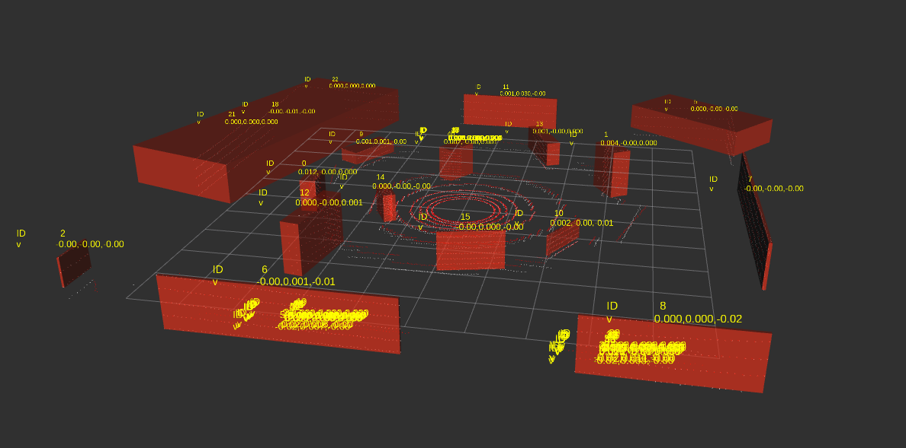

# LiDAR Object Detector

A ROS 2 perception system that processes 2D and 3D LiDAR data to detect, track, and visualize obstacles for autonomous robots.



## Features

- 2D and 3D LiDAR processing
- Point filtering and 3D voxel downsampling
- Efficient spatial-grid clustering
- Axis-aligned and oriented bounding boxes
- Kalman-filtered obstacle tracking
- Persistent obstacle IDs and velocity estimates
- Gazebo simulation with a mobile TurtleBot and 3D LiDAR
- RViz2 visualization
- Nav2-compatible obstacle output
- Automated tests and performance benchmarks
- Docker build environment

## Processing pipeline

```text
LiDAR data
   ↓
Filtering and downsampling
   ↓
Obstacle clustering
   ↓
Bounding-box generation
   ↓
Tracking and ID assignment
   ↓
ROS 2 topics and RViz2 visualization
```

## Build and test

```bash
source /opt/ros/jazzy/setup.bash
cd ~/projects/LiDar-Object-Detector

cmake -S . -B build -G Ninja
cmake --build build
ctest --test-dir build --output-on-failure

colcon build --base-paths detector_ros --symlink-install
source install/setup.bash
```

## Run the simulations

Start the 2D detector:

```bash
ros2 launch lidar_detector_ros custom_world_detector.launch.py
```

Start the 3D detector:

```bash
ros2 launch lidar_detector_ros custom_world_3d_detector.launch.py
```

The 3D detector publishes processed point clouds and tracked obstacle markers. In RViz2, enable the point-cloud displays and the `MarkerArray` display for `/obstacles_3d`.

## Performance

The detector includes benchmarks comparing brute-force clustering with spatial-grid clustering. The optimized implementation becomes increasingly faster as point-cloud size grows while preserving the same cluster assignments.

```bash
cmake -S . -B build-release -G Ninja -DCMAKE_BUILD_TYPE=Release
cmake --build build-release

./build-release/benchmarks/clustering_benchmark
./build-release/benchmarks/clustering_benchmark_3d
```

Detailed benchmark methodology is available in [docs/BENCHMARK_RESULTS.md](docs/BENCHMARK_RESULTS.md).

## Scope

This project focuses on geometric LiDAR perception: detecting obstacle shapes, estimating motion, and publishing results to a ROS 2 system. It does not perform semantic object classification or implement SLAM.

## Conclusion

The project demonstrates a complete LiDAR perception workflow from raw sensor data to tracked 2D and 3D obstacles in simulation, with ROS 2 integration, RViz2 visualization, and Nav2-compatible outputs.
